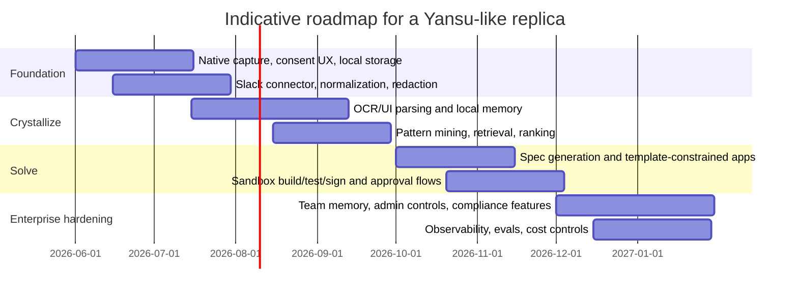

# Replicating a Yansu-Like Passive Work-Memory and App-Generation System

> Catty repo boundary note (2026-05-24): this is competitor / adjacent-architecture research.
> It is useful for anti-boundary checks, especially to avoid drifting into app-builder / workflow-factory territory.
> It is not Catty roadmap unless `docs/catty-thesis.md` and `docs/catty-v0-plan.md` are explicitly updated.

## Executive summary

Yansu publicly describes itself as a desktop-native, local-first system that runs on macOS, Windows, and Linux; observes desktop activity and messaging conversations across seven platforms; distills recurring work patterns into a local knowledge graph; and then generates “crystals,” which its technical reference says are React + TypeScript + Vite applications with an optional Bun backend. Its public materials frame the product in three phases: “Listen,” “Crystallize,” and “Solve.” citeturn1view0

A credible replica is technically feasible, but only if it is built as a **privacy-first hybrid system** instead of a pure cloud recorder. The winning pattern is: native edge capture on the user’s device; local OCR, accessibility-tree extraction, redaction, and episodic memory; optional cloud synchronization of **approved or redacted** features for team-level memory; and a cloud control plane for expensive reasoning, retrieval, code generation, CI-style validation, and deployment. This architecture best aligns with the hard constraints imposed by modern desktop capture APIs, Slack’s permission and rate-limit model, and privacy law requirements around profiling, consent, data minimization, and impact assessment. citeturn2search0turn25search1turn25search2turn3search1turn3search6turn28view1turn28view2turn13search1

The hardest parts are not screen capture or Slack ingestion by themselves. The real difficulty is turning noisy, privacy-sensitive multimodal traces into trustworthy, actionable knowledge and then safely converting that knowledge into workflow automations, bug fixes, or generated apps. In practice, the most defensible first product is **narrower than Yansu’s marketing promise**: start with pattern extraction, dashboards, workflow suggestions, and template-constrained internal tools; add autonomous app generation only once consent, retrieval quality, evaluation, and sandboxing are strong. That recommendation follows directly from the maturity gap between robust desktop observation APIs and the still-risky state of autonomous code/tool execution in LLM systems. citeturn2search0turn4search2turn4search3turn24search0turn14search0turn14search3

Several important assumptions were **not specified** in the request and materially affect design choices: target OS mix; expected seat count; whether raw screenshots may ever leave the device; whether generated outputs can take actions in external systems; whether the product is for individuals, strict enterprise IT, or employee-monitoring contexts; and whether team memory must be global, regional, or entirely local. The report therefore treats these as open design variables and recommends the least-regret default: **macOS + Windows first, Slack first, hybrid local-first privacy, and generated outputs gated by human approval in early releases.**

## What Yansu appears to do

Yansu’s public technical reference, last updated on 2026-03-28, says the product continuously observes desktop activity and team conversations, stores structured knowledge in a local “AI Memory” knowledge graph, and triggers a multi-step “crystal pipeline” that triages opportunities, extracts an app spec, generates code, and builds a working application locally. Its reference also says generated applications are React + TypeScript + Vite projects with an optional Bun backend, and that generated apps can be refined through conversation. citeturn1view0

That public description implies a replica needs three distinct subsystems, not one monolith. The first subsystem is an **observation layer**: desktop capture, metadata extraction, conversation ingestion, event normalization, privacy filtering, and long-term storage. The second is a **crystallization layer**: summarization, workflow mining, preference extraction, memory construction, retrieval, and ranking of “opportunity candidates.” The third is a **solve layer**: spec generation, retrieval-grounded reasoning, code generation, testing, packaging, deployment, and post-deployment learning. Yansu’s own reference is high-level about how it trains or evaluates these pieces, so a replica must make explicit engineering choices that the public product docs do not disclose. citeturn1view0

The phrase “passively listens” should not be implemented as indiscriminate full-motion recording by default. Modern operating systems expose screen-capture and accessibility APIs that are secure but permission-bounded, and open-source capture systems increasingly favor **event-driven capture** over continuous frame recording to reduce CPU, storage, and privacy exposure. ScreenCaptureKit is Apple’s high-performance, fine-grained framework for screen streaming; Windows Graphics Capture is secure and built around user consent and picker flows; and Linux desktop sandboxing relies on XDG Desktop Portal screencast sessions. Open-source Screenpipe also explicitly documents an event-driven capture model that triggers on meaningful UI changes rather than recording every second, pairing screenshots with accessibility trees when available. citeturn2search0turn25search1turn25search2turn26search1turn26search0

For messaging data, Slack is the practical first connector because its official APIs support both event subscriptions and history access. Slack’s Events API can deliver events through Socket Mode or HTTP endpoints, `conversations.history` supports backfill, and history scopes are explicitly limited to conversations the app has been added to. That means a Yansu-like system can be genuinely useful without requiring blanket access to every message in a workspace. At the same time, Slack has tightened rate limits for commercially distributed, non-Marketplace apps on `conversations.history` and `conversations.replies`, which pushes a product replica toward either Marketplace approval, enterprise-internal distribution, stronger edge-side caching, or narrower backfill windows. citeturn2search3turn3search1turn3search0turn27search0turn27search1turn27search12turn3search6

## Technical principles for the listen, crystallize, and solve loop

A robust **listen** stage should combine four data channels rather than relying on screenshots alone: screen pixels, accessibility/UI trees, application/window metadata, and message events. Pixel-only capture is expensive and brittle; accessibility trees often expose buttons, text labels, fields, and structural UI elements more cleanly than OCR, while OCR remains essential for remote desktops, screenshots of images, embedded canvases, PDFs, and apps with poor accessibility metadata. Apple’s Accessibility framework, Microsoft UI Automation, and AT-SPI on Linux all exist precisely to expose machine-readable UI structure, and Screenpipe’s official materials point the same way by pairing captures with accessibility trees and falling back to OCR when necessary. citeturn23search0turn23search1turn23search6turn26search1

For screenshot understanding, the most practical architecture is **structured perception first, generative interpretation second**. OCR/document models such as PaddleOCR and LayoutLMv3 are strong at extracting text, regions, and layout from screenshot-like artifacts; specialized UI vision-language models such as ScreenAI improve element typing and UI grounding; and frozen-encoder multimodal schemes such as BLIP-2 are attractive because they bridge vision encoders and LLMs without requiring extremely expensive end-to-end multimodal training. CLIP-style embeddings remain valuable for compact semantic image matching and retrieval. In other words: do not send every screenshot directly to a frontier multimodal model; instead, normalize screenshots into typed UI/text objects and only escalate ambiguous cases to a stronger VLM. citeturn11search3turn4search1turn4search2turn22search3turn4search0

For message understanding, the core NLP job is not general chat summarization; it is **conversation-to-workflow extraction**. The system needs thread reconstruction, speaker attribution, entity linking, temporal compression, repeated-request detection, preference extraction, and task/opportunity inference. Slack’s official permission model also strongly suggests designing around deliberate scopes and thread-aware retrieval instead of “ingest everything.” In practice, the most useful message-derived artifacts are not full summaries but compact semantic records such as: recurring question, tool mentioned, artifact mentioned, user frustration marker, policy statement, decision, owner, deadline, and confidence. citeturn3search9turn27search11turn27search16turn3search0

The **crystallize** stage should use multimodal fusion anchored on time, actors, tools, artifacts, and intent. The multimodal literature is clear that fusion can happen early, late, or in hybrid form; for this product class, hybrid fusion is the most pragmatic choice. Do early alignment between OCR text and accessibility nodes; perform modality-specific encodings for screenshots and messages; and then do late-stage fusion in a retrieval-and-reasoning layer that can explain *why* it inferred a workflow, preference, or opportunity. This preserves debuggability and lets the system degrade gracefully if one modality is missing. citeturn22search0turn22search12

A useful memory model is a blend of **episodic memory**, **semantic memory**, and **profile memory**. The generative-agents literature uses a memory stream plus reflection and planning; that maps well here. Raw user events become episodic traces; periodic reflection jobs synthesize them into stable semantic facts such as “team uses Jira for sprint tasks,” “review comments prefer concise repro steps,” or “Monday mornings repeatedly involve spreadsheet reconciliation”; and profile memory stores stable preferences, accepted/rejected suggestions, privacy settings, and app permissions. GraphRAG-like approaches are then a natural fit because workflow and team-pattern questions are usually relational, not just semantic-nearest-neighbor problems. citeturn5search0turn24search0turn24search4turn4search3

The **solve** stage should be explicitly constrained. Retrieval-augmented generation is the default because it keeps reasoning grounded in fresh, attributable work memory instead of trying to encode team process in model weights. When the system generates an improved workflow, dashboard, or internal tool, it should first produce a typed spec, then generate code into guarded templates, then run deterministic validation, then surface the result for approval. This is safer and more maintainable than unconstrained “build whatever seems useful” autonomy. The same principle applies to bug fixes: retrieve the minimal relevant context, propose a patch, run tests and static checks, and require a human signoff until offline evals demonstrate strong reliability. citeturn4search3turn24search0turn14search0

## Recommended architecture patterns and stack options

The architecture question is fundamentally about where the product performs capture, privacy filtering, retrieval, and generation. The best default is **hybrid local-first**: capture and first-pass understanding on device; advanced reasoning and heavy code generation in the cloud only after explicit policy checks and, ideally, user or admin approval. That recommendation is driven by OS permission models, Slack’s connector model, and the compliance burden of profiling sensitive work activity. citeturn25search0turn25search1turn25search2turn3search1turn28view1turn28view2

| Architecture pattern | Strengths | Weaknesses | Best fit | Recommendation |
|---|---|---|---|---|
| **Edge-only local-first** | Strongest privacy posture; lowest raw-data egress; best offline behavior | Harder team memory; harder central updates/evals; limited heavy inference | Solo users, regulated pilots, very small teams | Good for prototypes and sensitive pilots |
| **Hybrid local-first** | Best balance of privacy, UX, team memory, and scalable generation | More system complexity; two trust boundaries to manage | Most enterprise products | **Recommended default** |
| **Cloud-first thin agent** | Simplest centralized ops and analytics; easiest team-wide memory | Highest privacy/regulatory risk; captures more raw data centrally; poor offline story | Only if privacy sensitivity is low and org approval is strong | Not recommended as the starting point |

The comparison above is synthesized from the operating-system consent models for screen capture, Slack’s event and scope model, and privacy-law requirements around minimization, consent, and profiling. citeturn2search0turn25search1turn25search2turn3search1turn27search0turn27search1turn27search12turn28view1turn28view3turn13search1

A reliability-first technology stack should be polyglot by design: **Rust** or another native systems language for capture and hot-path local processing; **TypeScript/React** for the desktop product and generated applications; **Python** for ML/CV/NLP services and evaluation pipelines; and SQL/vector/graph/OLAP stores for different retrieval duties. Tauri is the stronger default desktop shell when binary size and native integration matter, while Electron remains the safest all-purpose alternative when plugin ecosystem and packaging familiarity are more important. citeturn6search0turn6search1turn6search17

| Layer | Primary recommendation | Strong alternative | Why this is the best default |
|---|---|---|---|
| Desktop shell | **Tauri + React/TypeScript** | Electron + React/TypeScript | Tauri supports any web frontend and uses the OS-native renderer; Electron is enterprise-proven and simpler for web-heavy teams. |
| Native capture agent | **Rust** with OS-specific modules | C++ for maximum low-level control | Rust fits Tauri and the existing ecosystem around privacy-first desktop tooling. |
| Screen capture | **ScreenCaptureKit / Windows Graphics Capture / XDG Portal** | Third-party abstraction only as a wrapper | Use native APIs directly because permissions and performance are OS-specific. |
| Message connector | **Slack Events API + Socket Mode + selective backfill** | HTTP Events API for centralized cloud ingress | Socket Mode avoids public endpoints and fits edge-local ingestion well. |
| Edge inference | **ONNX Runtime**, Core ML on Apple, optional MLX/OpenVINO | Ollama or llama.cpp for local LLM serving | Best mix of portability and on-device acceleration. |
| Server inference | **vLLM** or **SGLang** | TensorRT-LLM on NVIDIA-heavy fleets | vLLM and SGLang both target low-latency, high-throughput serving and expose OpenAI-compatible APIs. |
| Workflow orchestration | **Temporal** | Argo Workflows | Temporal is best for durable long-running application workflows; Argo is excellent for container-native DAG jobs. |
| Batch/ML orchestration | **Kubeflow + MLflow** | Airflow for classic batch only | Kubeflow covers the AI lifecycle; MLflow handles experiment tracking and evaluation. |
| Transactional + vector store | **Postgres + pgvector** | Qdrant or Pinecone | Postgres + pgvector keeps vectors close to relational data and reduces moving parts early. |
| Graph memory | **Neo4j** | Microsoft GraphRAG pipeline over existing stores | Relational facts alone are weak for workflow and team-pattern reasoning. |
| Analytics / dashboards | **ClickHouse** | BigQuery/Snowflake in cloud-heavy orgs | High-volume event analytics and observability are a natural fit. |
| Event bus | **NATS** | Kafka / MSK / Redpanda | NATS is lightweight and fast; Kafka is stronger when you need very large-scale replayable streams. |
| Observability | **OpenTelemetry + ClickHouse/Grafana** | Datadog + Sentry | OTel is vendor-neutral; Datadog and Sentry are strong commercial complements. |

The capabilities named above come from official product documentation for Tauri, Electron, Slack, ONNX Runtime, Core ML, MLX, OpenVINO, vLLM, SGLang, TensorRT-LLM, Temporal, Argo, Airflow, Kubeflow, pgvector, Qdrant, Neo4j, ClickHouse, NATS, Kafka, OpenTelemetry, Datadog, Sentry, Pinecone, and Weaviate. citeturn6search0turn6search1turn3search1turn12search0turn12search1turn12search2turn12search3turn9search2turn9search3turn10search6turn6search2turn9search1turn8search6turn8search7turn10search3turn7search0turn7search1turn7search2turn7search3turn8search9turn8search12turn6search3turn20search0turn20search1turn20search2turn20search3

The final recommended architecture is below. It is intentionally **edge-heavy for observation and privacy**, and **cloud-selective for expensive reasoning and generation**. That is the least-regret path if the product must feel “passive” without becoming “surveillance software.” citeturn2search0turn25search1turn25search2turn3search1turn4search3turn24search0turn6search2

```mermaid
flowchart LR
    subgraph Edge["User device and local trust boundary"]
        A[Native capture daemon\nRust\nScreenCaptureKit / Windows Graphics Capture / XDG Portal]
        B[Event sampler\napp-switch, input-idle, UI-change triggers]
        C[UI understanding\naccessibility tree + OCR + screenshot parser]
        D[Slack connector\nSocket Mode + selective backfill]
        E[Normalizer\nentities, tasks, tools, people, artifacts]
        F[Local policy engine\nconsent, redaction, PII filtering]
        G[Local memory\nSQLite/Postgres + pgvector]
        H[Pattern miner\nroutines, preferences, opportunities]
        I[Review UI\nsuggestion inbox + approvals]
        A --> B --> C --> E
        D --> E
        E --> F --> G
        G --> H --> I
    end

    subgraph Cloud["Optional tenant cloud boundary"]
        J[Approved/redacted features only]
        K[NATS or Kafka]
        L[Temporal workflows]
        M[Team memory\nGraph + vector retrieval]
        N[Reasoning / codegen workers\nvLLM/SGLang or external APIs]
        O[Sandbox build, tests, policy checks]
        P[Artifact registry + deployment]
        Q[Generated apps, dashboards,\nworkflow automations, bug-fix proposals]
        J --> K --> L --> M --> N --> O --> P --> Q
    end

    I -->|user/admin opt-in| J
```

## Privacy, security, and compliance by design

A product in this category lives or dies on **consent design**, not just encryption. Apple explicitly requires users to control which apps can record screen and system audio; Windows Graphics Capture exposes a secure model with user consent and a picker UI; and Linux screencast access is mediated through XDG Desktop Portal. A trustworthy replica should mirror that spirit in-product: per-source consent, first-run education, clear pause controls, per-app allow/deny lists, visible capture indicators, retention controls, export/delete flows, and separate opt-ins for personal memory, team memory, and cloud generation. citeturn25search0turn25search1turn25search2

The default privacy posture should be **local processing first**. That means screenshots should be parsed locally into structured events, accessibility text, entities, and embeddings; messages should be normalized locally wherever feasible; and raw screenshots should only leave the device if the user or admin has explicitly enabled a cloud feature that requires them. This mirrors Yansu’s own public local-first claims and materially reduces exposure because cloud-side image tokenization and raw screenshot retention are both costlier and riskier than transmitting compact structured summaries. citeturn1view0turn17view0

Encryption and key management should be boring and strong. At minimum: TLS for every network hop, envelope encryption for at-rest data, separate tenant keys for cloud stores, OS keychain storage for local secrets, and short-lived scoped tokens where connectors support them. NIST’s key-management guidance is directly relevant here because the system will hold model-provider keys, Slack tokens, signing keys for generated artifacts, and possibly customer-managed encryption keys. citeturn14search2

For analytics and team-level learning, use **de-identification and differential privacy selectively**, not as magical blanket solutions. NIST’s de-identification guidance is clear that de-identification is a risk-reduction process, not a guarantee, and Dwork’s differential privacy work is about bounding privacy loss under aggregate release mechanisms. That means DP is appropriate for cross-user aggregate statistics such as “how many people repeat this workflow?” or “which dashboards are most accepted?”, but **not** for preserving the full fidelity of personal work memory. For the raw memory layer, strong minimization, redaction, scoped sharing, and retention limits matter more. citeturn5search3turn5search10

GDPR makes several design requirements non-optional. Article 5 requires data minimization; Article 25 makes privacy by design and default explicit; Article 7 requires demonstrable, withdrawable consent when consent is the legal basis; and Article 35 requires a data protection impact assessment where processing is likely to create high risk. The EDPB has also issued guidance on profiling and automated decision-making, which is especially relevant because a Yansu-like system is explicitly inferring patterns and proposing actions from work behavior. citeturn28view1turn28view3turn28view2turn13search1

California privacy law points the same direction. The CCPA requires point-of-collection notice about categories and purposes of collection, and the CPPA’s regulations now include updated CCPA rules plus 2025 regulations on cybersecurity audits, risk assessments, and automated decision-making technology. For a replica that touches California users, “We collect screenshots and messages to generate workflow intelligence” is not enough; the product must be explicit about what it collects, why, where it goes, how long it lives, and how users can opt out, delete, or limit certain processing. citeturn29search1turn29search0turn29search3

The main security risks are concentrated in six places: prompt injection from messages or screenshots; over-broad connector scopes; privacy leakage in memory retrieval; unsafe code or tool execution; supply-chain compromise in generated apps; and model/data poisoning from untrusted feedback loops. OWASP’s LLM Top 10, NIST AI RMF, and CISA’s Secure by Design guidance all point toward the same mitigations: least privilege, bounded tool access, output validation, strong provenance and logging, human review at high-risk decision points, and secure defaults that reduce user burden rather than requiring users to manually “configure themselves to safety.” citeturn14search0turn14search1turn14search3

| Security risk | Why it is acute here | Recommended mitigation |
|---|---|---|
| Prompt injection from Slack or screenshots | The system reasons over untrusted text and UI content | Treat retrieved context as untrusted; separate instructions from data; apply model-side and policy-side tool guards |
| Over-collection and scope creep | Passive products drift toward “collect everything” | Per-source scopes, app-specific allowlists, retention caps, and explicit admin approval flows |
| Privacy leakage from memory retrieval | Team memory can surface private user traces | Strong tenant/user filters, attribute-based access control, redaction before indexing, and source-aware retrieval |
| Unsafe code generation or automation | “Solve” can turn bad inferences into real actions | Template-constrained generation, sandbox builds, static analysis, tests, signed artifacts, approval gates |
| Supply-chain compromise | Generated apps may pull dependencies and secrets | Locked dependency manifests, provenance signing, secret scanning, isolated build runners |
| Feedback-loop poisoning | User edits and connector data can distort future models | Versioned datasets, evaluation gates, rollbackable memories, and human-reviewed promotion to shared memory |

This risk model is derived from OWASP’s LLM application risk guidance, NIST’s AI RMF, CISA’s Secure by Design principles, Slack’s permission model, and the capture-consent constraints of desktop operating systems. citeturn14search0turn14search1turn14search3turn27search5turn25search0turn25search1turn25search2

## Training, inference, orchestration, scalability, latency, and cost

The most robust inference strategy is **three-tiered**. Tier one is on-device local inference for OCR, ASR, embeddings, UI classification, and lightweight policy checks, using runtimes such as ONNX Runtime, Core ML, MLX on Apple Silicon, or OpenVINO on Intel-heavy fleets. Tier two is server-side high-throughput serving for small and mid-size open models, typically with vLLM or SGLang. Tier three is selectively invoking commercial frontier models for the hardest reasoning and code-generation jobs. This minimizes cloud cost and privacy exposure without giving up capability. citeturn12search0turn12search1turn12search2turn12search3turn9search2turn9search3turn15search0turn15search1

For personalization, prefer **retrieval and memory updates over frequent full-model fine-tuning**. RAG exists precisely because model parameters are a poor place to store fast-changing private knowledge, and GraphRAG improves over naïve semantic chunk retrieval when relationships matter. Fine-tuning still has a role, but mainly for narrow extractors, rankers, or classifiers; adapter-based methods such as LoRA and PEFT are the right default because they are cheaper to train and easier to manage than full fine-tunes. Continual learning should therefore mean “continually update memory and ranking signals,” not “continually mutate the base model every day.” citeturn4search3turn24search0turn24search4turn10search0turn10search1

Orchestration should be split by workload type. Use **Temporal** for long-running, stateful product workflows such as “observe → infer opportunity → request approval → generate → test → deploy,” because it is designed for durable workflow execution through crashes and retries. Use **Argo** for Kubernetes-native DAG jobs when the workload is essentially container batch. Use **Airflow** for classical data engineering and scheduled backfills, not for reactive, user-centric flows; even the project’s own guidance says Airflow works best with workflows that are mostly static and slowly changing. Use **Kubeflow** for training, tuning, and model lifecycle operations. citeturn6search2turn9search1turn8search6turn8search7

Scalability should be treated as four separate scaling problems. First, **capture scale**: screenshots and UI events grow linearly with seats and activity, so event-driven capture and deduplication matter far more than raw GPU spend. Second, **memory scale**: keep hot personal memory local and push only curated/redacted summaries upstream. Third, **reasoning scale**: gate expensive model calls behind confidence thresholds and change detectors. Fourth, **generation scale**: build a queueing and approval system, because autonomous generation workloads are bursty and benefit from durable orchestration more than from purely synchronous APIs. citeturn26search1turn26search0turn6search2turn8search12

A practical latency target is: sub-second for local capture and event logging; low-single-digit seconds for local summarization or opportunity previews; tens of seconds to a few minutes for approved app or dashboard generation; and asynchronous execution for heavy rebuilds, backfills, or cross-user team-memory refreshes. This latency split matches the design intent of native capture APIs, durable workflow engines, and high-throughput inference servers rather than forcing every action into a chat-style request/response shape. citeturn2search0turn25search1turn6search2turn9search2turn9search3

The cost structure is dominated by **model tokens and GPU inference**, not by basic platform plumbing. Official pricing anchors are useful here: Amazon EKS standard cluster support is $0.10 per cluster-hour, or about $73 per 730-hour month; an AWS MSK example prices a `kafka.m7g.large` broker at $0.204/hour, which is about $146.88 per broker-month before storage; S3 Standard GET requests are $0.0004 per 1,000, so one million GETs cost about $0.40; OpenAI’s pricing page lists GPT-5.4 mini at $0.75 per 1M input tokens and $4.50 per 1M output tokens; Anthropic’s pricing page lists Claude Sonnet 4.5 at $3/MTok input and $6/MTok output; and Anthropic batch pricing cuts that in half for supported batch flows. citeturn18view0turn18view3turn18view2turn17view2turn17view3

An illustrative token-cost benchmark shows why edge preprocessing matters. If cloud reasoning consumed roughly **30M input tokens and 6M output tokens per active user-month**, GPT-5.4 mini pricing works out to about **$49.50 per user-month**, while Claude Sonnet 4.5 would be about **$126 per user-month**. At 100 active users, those two examples become roughly **$4,950/month** and **$12,600/month** respectively, before infrastructure and before any image-heavy analysis. Because OpenAI’s pricing explicitly notes that some text models convert images into tokens charged at standard text-token rates, sending raw screenshots upstream too often can overwhelm a budget very quickly; therefore, push OCR, accessibility extraction, deduplication, and summarization to the edge wherever possible. citeturn17view2turn17view3turn17view0

Self-hosted inference is viable, but only if it is used deliberately. AWS describes its G6e family as optimized and cost-efficient for generative AI inference, and a current third-party EC2 catalog lists `g6e.xlarge` at roughly **$1.861/hour**, or about **$1,358.53 per 730-hour month**, as an indicative price point for an L40S-class inference node. That can be attractive for always-on tenant workloads or privacy-sensitive on-prem deployments, but a replica should treat this as a capacity-planning reference, not a universal quote, because actual cost depends on region, discounts, utilization, and whether the workload is steady enough to justify dedicated GPUs. citeturn30search2turn30search9

## Implementation roadmap and effort

A staged roadmap is essential because “listen,” “crystallize,” and “solve” mature at very different rates. The lowest-risk path is: first build trustworthy capture and memory; then build high-quality pattern extraction and retrieval; then add constrained generation; then expand to team memory and enterprise controls. Trying to launch all three stages at full strength together is the fastest route to privacy blowback, hallucinated “insights,” and unsafe generated outputs.

| Milestone | Scope | Indicative effort |
|---|---|---|
| **Foundation pilot** | Native capture, Slack OAuth/Socket Mode, local storage, consent UX, pause controls, basic OCR/accessibility parsing | **8–12 engineering-months** |
| **Crystallization MVP** | Entity extraction, workflow mining, local memory, retrieval UI, suggested dashboards/insights, acceptance feedback loop | **10–16 engineering-months** |
| **Constrained solve** | Spec generation, template-based dashboards/tools, sandbox build/test, approval gates, audit logging | **8–14 engineering-months** |
| **Enterprise hardening** | Team memory, admin controls, SSO, policy engine, retention controls, compliance workflows, observability | **10–18 engineering-months** |
| **Autonomous expansion** | Safer bug-fix generation, workflow automation, cross-tenant evals, broader connectors | **6–12 engineering-months** |

A realistic **personal or small-team MVP** is therefore roughly **18–28 engineering-months** if the team is strong in native desktop, backend, and applied ML. A more credible **enterprise-grade product** with governance, reliability, and secure generation is more like **36–60 engineering-months**, depending on how much autonomy is allowed and how broad the connector surface becomes.

The most important milestone decision is not technical but product-scoping: whether “solve” initially means **insights and generated dashboards**, or **fully autonomous application creation and workflow execution**. The former is materially easier, cheaper, and safer.

## Open questions and limitations

The public sources are enough to understand Yansu’s **published product shape**, but they do **not** disclose a number of implementation details that matter if the goal is a close replica rather than a functionally similar product. In particular, Yansu’s public materials do not specify capture cadence, labeling strategy, evaluation methodology, redaction pipeline internals, training data sources, or the exact boundary between local and cloud inference in paid plans. citeturn1view0

The largest unresolved design questions for a replica are these:

- Whether raw screenshots may ever leave the user’s machine, even temporarily.
- Whether team memory is required from day one, or whether local personal memory is enough for the first release.
- Whether “solve” must include autonomous code execution and deployment, or whether human-approved generation is acceptable initially.
- Whether the product will be marketed as an employee productivity assistant, a personal workflow memory, or an enterprise internal-tools builder, because those positions create very different privacy, trust, and adoption constraints.

Given those uncertainties, the least-regret conclusion is straightforward: **build a hybrid, local-first, multimodal memory system first; treat autonomous generation as a later capability; and make privacy, approval, and retrieval quality the non-negotiable center of the architecture.**
